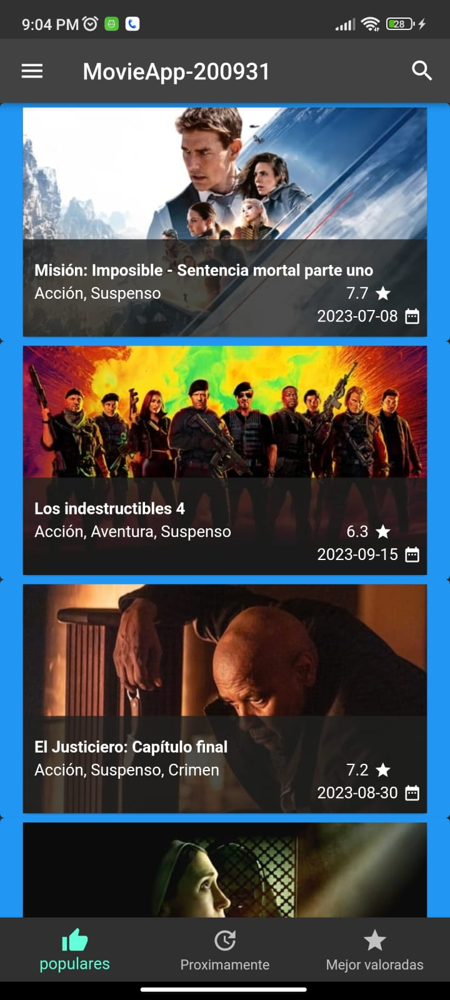
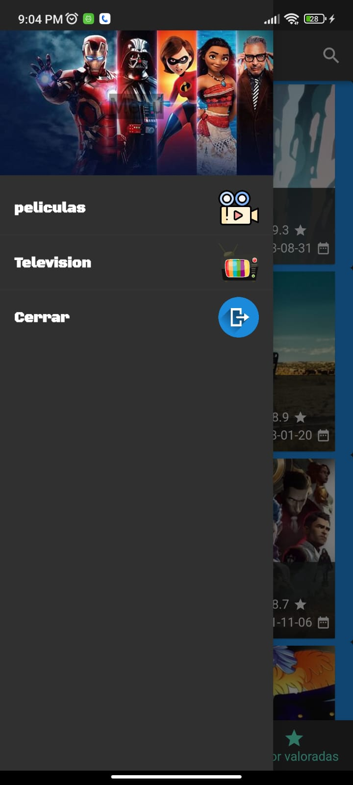
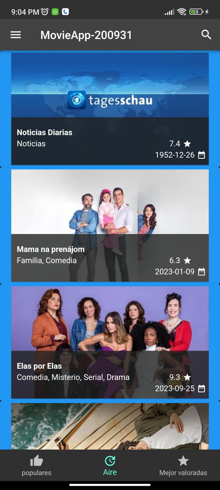

# MovieApp-200931

## Información General

- **Creado por:** Uriel Maldonado Cortez
- **Asignatura:** Desarrollo Movil Integral
- **Grado:** 10
- **Grupo:** A
- **Docente:** MTI. Marco Antonio Ramirez Hernandez

## Descripción del Proyecto

Este proyecto representa una aplicación de muestra desarrollada en Flutter que muestra una página de inicio de la aplicación "MovieApp-200931". La página de inicio contiene los siguientes componentes principales:

### `Home.dart`

Este archivo contiene la clase `Home`, que representa la página de inicio de la aplicación. En el método `initState`, se llama a `_loadJson` para cargar datos de películas utilizando `HttpHandler`. También se define un estilo de fuente personalizado y se crea la estructura principal de la aplicación, que incluye una AppBar, un Drawer y un BottomNavigationBar.

### 1. AppBar (Barra de Navegación Superior)

La AppBar muestra el título "MovieApp-200931" en el centro y un icono de búsqueda en la esquina derecha. Aquí se puede realizar la navegación y realizar búsquedas.

### 2. Menú Lateral (Drawer)

El menú lateral se abre deslizando desde el borde izquierdo de la pantalla o tocando el icono de menú en la AppBar. Contiene las siguientes opciones:

- **"peliculas"**: Una opción que muestra películas y utiliza un estilo de fuente personalizado para dar formato al texto.

- **"Television"**: Una opción que muestra programas de televisión y utiliza el mismo estilo de fuente personalizado.

- **"Cerrar"**: Una opción que permite cerrar el menú lateral y volver a la página de inicio.

### 3. Barra de Navegación Inferior (BottomNavigationBar)

La barra de navegación inferior contiene tres elementos:

- **"populares"**: Muestra películas populares y tiene un ícono de pulgar hacia arriba.

- **"Proximamente"**: Muestra películas próximas a estrenarse y tiene un ícono de actualización.

- **"Mejor valorados"**: Muestra películas mejor valoradas y tiene un ícono de estrella.

En esta Practica del proyeto Hicimos lo soguiente:
La función _getMediaList() es responsable de construir y devolver una lista de widgets, específicamente widgets de tipo MediaList, que son componentes de interfaz de usuario utilizados para mostrar listas de películas o programas de televisión. La elección entre películas y programas de televisión se basa en el valor de la variable mediaType.

Si mediaType es igual a MediaType.movie, la función crea tres instancias de MediaList, una para cada categoría de películas: "popular," "upcoming," y "top_rated." Estas instancias se crean utilizando el proveedor de medios de películas (movieProvider) y la categoría correspondiente. Cada MediaList es un widget que mostrará una lista de películas de la categoría seleccionada.

Si mediaType no es igual a MediaType.movie, la función crea tres instancias de MediaList, una para cada categoría de programas de televisión: "popular," "on_the_air," y "top_rated." Estas instancias se crean utilizando el proveedor de medios de programas de televisión (showProvider) y la categoría correspondiente. Cada MediaList es un widget que mostrará una lista de programas de televisión de la categoría seleccionada.

Esta función permite que la aplicación "MovieApp-200931" sea versátil y se adapte a las preferencias del usuario al mostrar diferentes categorías de contenido. Los usuarios pueden cambiar entre películas y programas de televisión, y la función _getMediaList() garantiza que se muestre la información correcta en la página de inicio.

## Capturas de Pantalla

  
  
  
  
  
  
  
  
  

## Instalación

Para ejecutar esta aplicación en tu entorno de desarrollo, sigue estos pasos:

1. Asegúrate de tener Flutter y Dart instalados en tu sistema.

2. Clona este repositorio o descarga el código fuente.

3. Abre una terminal en la carpeta del proyecto.

4. Ejecuta `flutter pub get` para obtener las dependencias.

5. Ejecuta `flutter run` para iniciar la aplicación en un emulador o dispositivo físico.

Este proyecto es un ejemplo sólido de una página de inicio en Flutter que utiliza elementos de interfaz de usuario personalizados y estilos de fuente únicos. Si tienes alguna pregunta o necesitas ayuda adicional, no dudes en contactar al autor.
